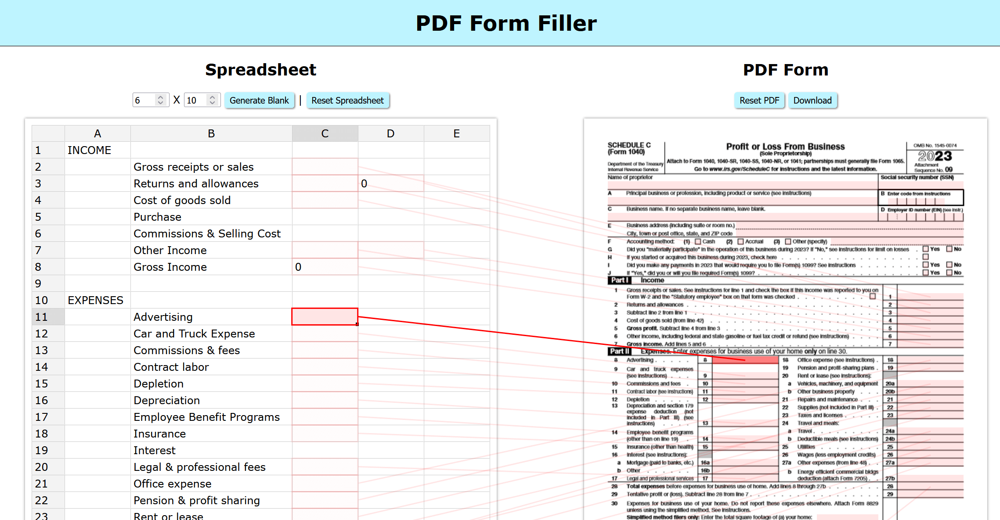

# Spreadsheet to PDF form filler

This application grabs data from any spreadsheet and inputs it to any PDF Form.

## Development environment

Install **node js**

Run `npm install` in console to setup dependencies

Run `npm start` in console to start the application

## Documentation

### Getting Started

Select the desired dimensions for the spreadsheet and click **Generate Blank** or import data by dragging and dropping a `.csv` file or clicking on the upload icon to open the file explorer.

Drag and drop a PDF or click the upload icon to open the file explorer to import a PDF.
Here's a great example form with many form fields:
https://www.irs.gov/pub/irs-pdf/f1040sc.pdf

### Creating Connections

Form fields will show up as red rectangles on the PDF form. Click and drag from a form field to a cell on the spreadsheet to connect them. Alternatively you can click on the form field and then on the cell you wish to connect it to.

Right click on the PDF to open a context menu with various options to handle connections.

- **Save Connections**: Save connections made to a `.json` file.
- **Load Connections**: Load connections from a `.json` file created previously.
- **Clear Connections**: Remove all connections
- **AutoFill Connections**: First, select the cell or column you wish to form connections to. Then, select **AutoFill Connections** to create a connection for every field in the form.

### Spreadsheet Data

Right click to open a context menu with basic functions. The form supports basic shpreadsheet functions. e.g. `=Sum(a1:b2)` `=a1+a2`

### Checkboxes

While text input simply coppies the data from the spreadsheet, checkboxes are checked based on if the cell they are connected to reads a `true`(checked) or `false`(unchecked). You can write spreadsheet equations to evaluate if these boxes should be checked. e.g. `=a1>a2` `=b2=b3`

### Completing the Form

Click **Download** to view and download the PDF with data populated from the spreadsheet.
